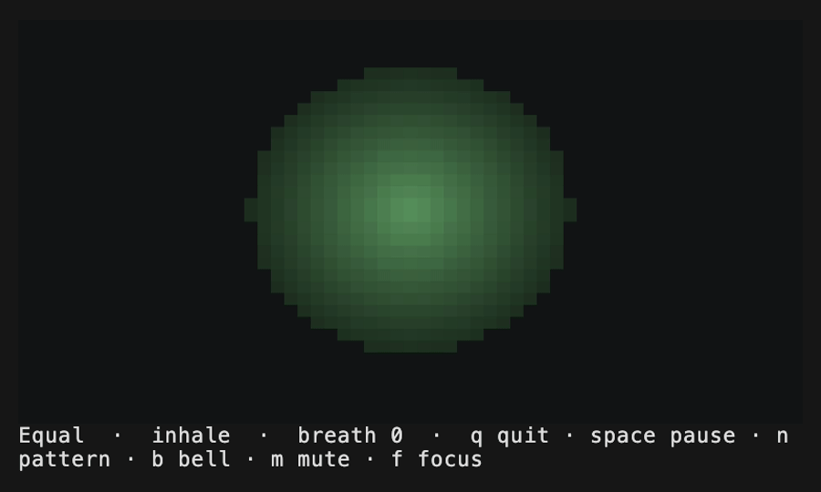

# meditate

A terminal breathing companion — paced breathing, soundscapes, and voice guides,
right where you already work. Open it in the mid-day drag and breathe through the
next twenty minutes without reaching for your phone.

[](https://github.com/walktalkmeditate/meditate-cli/releases)
[](https://github.com/walktalkmeditate/meditate-cli/actions/workflows/ci.yml)
[](LICENSE)



```
meditate
```

A moss-colored orb breathes in time with you; press a key to switch patterns or
sounds; press `q` when the meeting picks back up.

## Install

**Homebrew (macOS / Linux)**

```sh
brew install walktalkmeditate/tap/meditate
```

**One-line installers**

```sh
# macOS / Linux
curl -fsSL https://raw.githubusercontent.com/walktalkmeditate/meditate-cli/main/install.sh | sh
```

```powershell
# Windows
irm https://raw.githubusercontent.com/walktalkmeditate/meditate-cli/main/install.ps1 | iex
```

**From source** (Rust 1.82+)

```sh
cargo install --path . --features audio,download
```

The core breathing experience works with **zero downloads**. Sound packs are
optional and only fetched when you ask.

## Use

```sh
meditate                 # resume your last pattern, open-ended
meditate box             # start with a specific pattern
meditate --for 5m        # a timed session, ending with a soft bell
meditate --breaths 10    # end after ten breaths
meditate --reduce-motion # calmer, slower motion
meditate --title         # mirror the breath into the tab title (glanceable from another tab)
meditate --until "cargo build"   # breathe until a command finishes, then ring + notify
```

**Breathe while you wait:** `--until "<command>"` runs the command, breathes you
through the wait, and rings + fires a desktop notification when it finishes —
`✓` on success, `✗` with the error tail on failure. `q` leaves the command
running; Ctrl-C cancels it. Turns a slow build or deploy into a breath.

`--title` shows a block that rises and falls with the breath in your terminal's
tab/window title, so an inactive `meditate` tab still paces you while you work
elsewhere. Opt-in (or set `tab_title` in config); in tmux, add `set -g set-titles on`.

While breathing: `n` next pattern · `s` soundscape · `v` voice · `b` bell ·
`m` mute · `+`/`-` volume · `space` pause · `f` focus · `q` quit (Ctrl-C also
quits gracefully).

**Patterns:** Calm (5/7) · Equal (4/4) · Relaxing (4-7-8) · Box (4-4-4-4) ·
Coherent (5/5) · Deep calm (3/6) · None (open focus).

**Sound packs** (optional — the breathing and a synthesized bell need no
downloads at all):

```sh
meditate download soundscapes   # ambient loops       — press s to cycle
meditate download voices        # meditation guides   — press v to cycle
meditate download bells         # start/end bells     — press b to cycle (synth stays the default)
```

Re-running a download only fetches what you don't already have. Voice packs pull
their meditation prompts only — walk guidance is never downloaded.

**Other commands:** `meditate config` · `meditate streak` ·
`meditate integration install` (shell/tmux breathe nudges).

## Customize

Run `meditate config init` to drop a fully-commented `config.toml` with every
option at its default (or `meditate config` to preview the template without
writing). Set a default pattern, volume, or soundscape/voice/bell, rebind keys,
or turn features off — every line is optional, so zero-config still launches
instantly. `meditate config path` prints its location.

meditate also **remembers** where you left off — pattern, volume, and your
soundscape/voice/bell selection — and resumes there next time. Anything you pin
in `config.toml` always takes priority over that memory.

## Privacy

No account, no telemetry, no background network. The only network call meditate
ever makes is a pack download you explicitly ask for.

## License

MIT. A gift to the terminal community — and a quiet door to the
[Pilgrim](https://pilgrimapp.org) app if you'd like to keep walking with it.

---

<sub>The demo above is generated with [VHS](https://github.com/charmbracelet/vhs):
`vhs demo/meditate.tape`.</sub>
