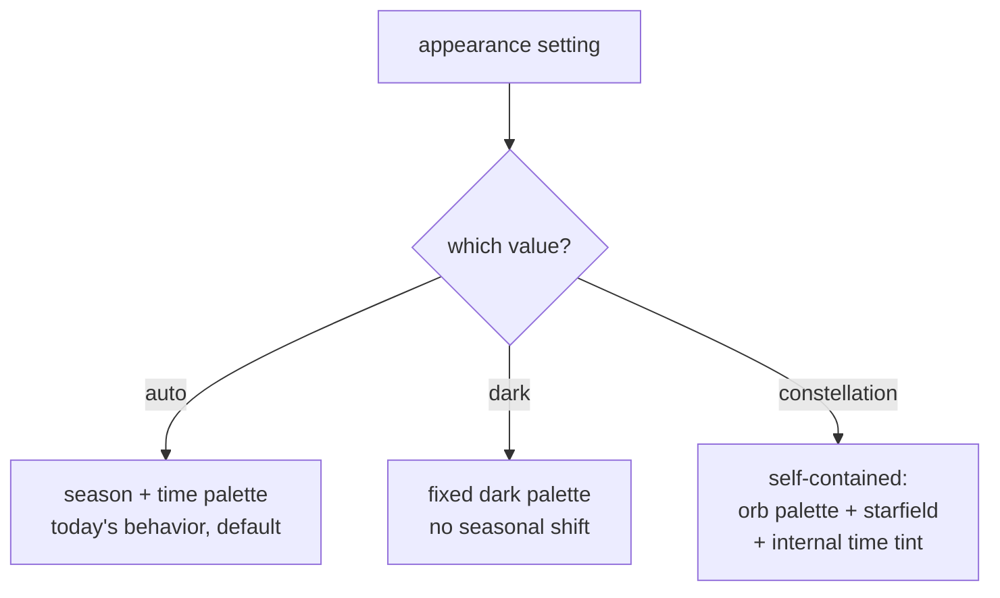

# Constellation Appearance for the Breathing Orb

## Summary

Add a terminal-native **Constellation** appearance: a Unicode starfield the breathing orb floats in, with deep-space depth and the nearest stars blooming on the exhale. It ships as a third value on a single appearance axis (`auto | dark | constellation`) and is built in stages — depth + breath first, then drift, then seasonal color.

---

## Problem Frame

Today the orb's look is *derived, not chosen*. `crates/meditate-core/src/palette.rs` starts from a base moss tone and auto-shifts it by real season (month) and time of day (hour): warmer at dusk, dimmed at night, cooler in winter. The only manual lever is `--pin-palette`, which freezes one of those dimensions. The background is a flat fill painted once behind the orb.

That quiet, ambient philosophy is worth keeping — but it leaves the experience visually still. The sibling iOS app reserves its most immersive look, *Constellation*, for exactly this: an animated cosmos the meditation lives inside. `web/src/orb-canvas.ts:9-11` already names it as a deliberately-absent, separate appearance mode. Bringing a constellation into the terminal — a starfield in your actual shell — is the kind of detail that deepens the practice and is unmistakably on-brand for a CLI meditation tool.

The shift this introduces: appearance becomes *selectable*, and the background becomes a *living layer* rather than a flat fill.

---

## Key Decisions

- **Single appearance axis, not an orthogonal ambience layer.** Appearance is one knob — `auto | dark | constellation` — rather than a palette axis plus a separate ambience axis. Simpler mental model and one config field. Accepted cost: Constellation re-derives its own seasonal tint internally instead of composing with the shared palette.
- **Terminal-first.** The terminal is Constellation's true home; a drifting glyph starfield in the shell is the differentiator. The web/canvas version is deferred.
- **Glyph stars with "breathing void" depth, not braille stardust.** Characterful Unicode glyphs in depth tiers, with the breath-lit clearing as the primary effect. Screenshot-able and on-brand, with a clean path to fuller volume-lighting later. Braille (fine stardust) was the smoother alternative and was set aside.
- **Magic-first staging.** Stage 1 = depth + breath; Stage 2 = drift; Stage 3 = seasonal color. The first cut must feel complete while static — depth and breath carry the magic, so Stage 1 chases those and nothing else.
- **Constellation is self-contained.** Following from the single-axis choice, the mode owns both its orb palette and its starfield; the "time-aware" layer lives inside the mode.

---

## Requirements

**Appearance model**

- R1. The orb's appearance is selectable on a single axis with three values: `auto`, `dark`, `constellation`.
- R2. `auto` preserves today's behavior — the orb palette derives from real season and time of day — and is the default when no appearance is set.
- R3. `dark` renders a fixed dark palette that does not shift with season or time.
- R4. `constellation` is self-contained: it owns both its orb palette and its starfield, deriving any time/season tinting internally rather than reading the shared palette.

**The Constellation field (Stage 1: depth + breath)**

- R5. In constellation mode the orb floats in a field of Unicode glyph stars rendered into the cells surrounding the orb.
- R6. Stars are organized into depth tiers; depth reads through brightness and density — nearer stars brighter, distant stars dim.
- R7. A clearing surrounds the orb: stars fade to nothing as they approach the orb's halo so the moss glow stays dominant.
- R8. On each breath, the nearest stars bloom on the exhale — brighten and ease outward — and settle on the inhale, phase-locked to the same breath clock that drives the orb.
- R9. Stage 1 delivers depth + breath with no required field motion; the mode must feel complete while static.

**Later stages (in scope, sequenced after Stage 1)**

- R10. Stage 2 adds gentle drift: the field acquires slow, continuous motion.
- R11. Stage 3 adds seasonal/time color: the field's hue and density reflect real season and time of day — Constellation's internal version of the auto-palette logic.

**Rendering, degradation & accessibility**

- R12. The field degrades across the existing render tiers: brightness-graded glyphs on truecolor/256-color; in mono / `NO_COLOR`, depth falls back to star density alone with no brightness grading.
- R13. `reduce_motion` (config) and `REDUCE_MOTION` (env) soften the breath bloom and (once present) freeze drift, while preserving the static depth and clearing.
- R14. The starfield must not regress orb legibility or frame stability on slow/SSH terminals; star updates flow through the existing surface diff/encoder.

**Configuration & control**

- R15. The selected appearance persists via the existing config/state mechanism and is overridable per-run by a CLI flag, mirroring how `--pin-palette` works today.
- R16. Selecting an appearance does not break existing `--pin-palette` behavior.

---

## Key Flows

- F1. Opening a session in constellation mode
  - **Trigger:** appearance resolves to `constellation` at session start.
  - **Steps:** resolve the constellation orb palette and starfield parameters (depth tiers, clearing radius) → paint the background field with depth-graded glyphs, fading inside the clearing → paint the orb (halo, core, ripple) on top → enter the breath loop.
  - **Outcome:** the orb floats in a still, deep starfield.
  - **Covered by:** R5, R6, R7, R4

- F2. The breath bloom cycle
  - **Trigger:** each breath-phase transition from the shared breath clock.
  - **Steps:** the breath clock advances → near-tier stars ease brightness and expansion toward the exhale peak → they settle on the inhale.
  - **Reduce-motion:** bloom amplitude is reduced; the field stays present.
  - **Outcome:** the near cosmos breathes with the user.
  - **Covered by:** R8, R13

---

## Acceptance Examples

- AE1. Breath bloom
  - **Covers R8, R13.**
  - **Given** constellation mode with `reduce_motion` off, **when** the user exhales, **then** the nearest stars brighten and ease outward; on the inhale they settle. With `reduce_motion` on, the bloom is present but subdued.

- AE2. Mono / NO_COLOR degradation
  - **Covers R12.**
  - **Given** a mono or `NO_COLOR` terminal, **when** constellation renders, **then** stars appear as sparse glyphs with depth conveyed by density only — no brightness grading and no color codes emitted.

- AE3. The clearing
  - **Covers R7.**
  - **Given** any render tier, **when** the field paints, **then** no star occupies the clearing around the orb's halo and the moss glow is unobstructed.

- AE4. Default is unchanged
  - **Covers R1, R2.**
  - **Given** no appearance configured, **when** a session starts, **then** `auto` behavior renders (today's season/time palette), identical to current.

---

## Scope Boundaries

**Deferred for later**

- Web/canvas constellation — the rich layered cosmos on the smooth orb. Terminal first.
- Drift (Stage 2) and seasonal color (Stage 3) — part of this feature, sequenced after Stage 1, not in the first cut.
- Kitty/iTerm graphics-tier real starfield imagery (the glyph technique is the chosen path).
- Soundscape-linked shimmer.

**Outside this product's identity**

- Light and system appearance modes on the terminal. A light/parchment background fights the terminal and washes out the moss; "follow the OS appearance" isn't a terminal concept. These may return only when the web surface arrives.
- Milestone/streak "light up a star" gamification — clashes with the calm, non-achievement ethos.

---

## Dependencies / Assumptions

- Reuses the existing breath-clock accessors (orb scale/glow/breath count) so the field stays phase-locked — no new timing source.
- Reuses the season/time logic in `crates/meditate-core/src/palette.rs` for Stage 3 tinting.
- The render pipeline can paint per-cell background glyphs behind the orb; the background shifts from a flat fill to a composed layer.
- Assumes truecolor/256-color for the full depth effect; mono is a graceful floor, not the target.

---

## Outstanding Questions

**Deferred to planning**

- Sub-cell rendering technique for glyph placement and (later) smooth drift — full-cell glyphs vs half-block vs braille for the drift stage.
- Exact depth-tier count, brightness curve, clearing radius, bloom amplitude and easing — tuning.
- How `--pin-palette` interacts with Constellation's internal tinting.
- Frame-flush / performance budget for star updates on slow or SSH terminals.

---

## Sources / Research

- `crates/meditate-core/src/palette.rs` — season/time palette engine to reuse for `auto` and Stage 3.
- `crates/meditate-core/src/render/orb.rs` — `OrbScene` / `paint`; where the orb composes over the background.
- `crates/meditate-core/src/render/mod.rs` — `Rgb` and render tiers (CellGradient / Mono / Kitty / iTerm) the field must degrade across.
- `src/session.rs` — palette resolution (~413-417) and frame render/flush (~877-916), where appearance resolves and frames are encoded.
- `src/cli.rs`, `src/config.rs`, `src/state.rs` — flag and persistence patterns to mirror, following `--pin-palette`.
- `web/src/orb-canvas.ts:9-11` — the comment establishing Constellation as a distinct appearance mode (the inspiration anchor) and the deferred web target.
