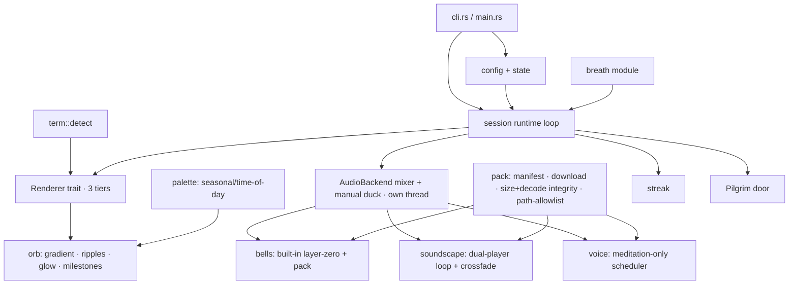
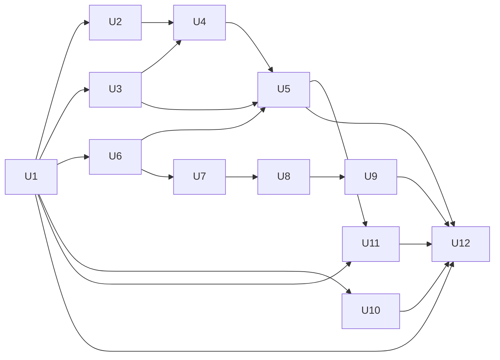

# feat: meditate — a terminal breathing companion (Rust)

## Summary

Build `meditate` as a Rust single binary structured around **two trait-based seams** — a capability-detected **renderer** (graphics tiers) and a cross-platform **audio mixer** with manual ducking — plus a **breath-cycle state-machine module**, an offline-first pack downloader, a hand-edited config layer, and `cargo-dist` packaging that reuses the existing `momentmaker/homebrew-tap`. Pattern *data* (timings, phase structure, scale endpoints, milestone set) is lifted from the Pilgrim iOS source; the orb's frame rendering, the audio mixing, pause/resume, the seasonal orb, and the config layer are **net-new for the terminal** and designed here, not ported.

---

## Problem Frame

A terminal-dwelling developer in the mid-day drag wants to breathe through a long meeting without leaving the screen or reaching for a phone. Prior art (`breathe-cli`) proves the appetite but ships only a 1-D progress bar, no real audio, and a Python-interpreter dependency. Pilgrim already has the tuned substance (7 patterns, a beautiful orb, voices, soundscapes, bells) but it lives on a phone behind a context switch. See origin for the full pain narrative (`docs/brainstorms/meditate-cli-requirements.md`).

---

## Requirements

This plan satisfies origin requirements R1–R19 and acceptance examples AE1–AE7. Key traces:

- **R1–R7** (core breathing experience) → U3, U4, U5
- **R8–R9** (live keyboard control) → U5
- **R10–R13** (opt-in sound layers, offline-first, meditation-only voice) → U6, U7, U8, U9
- **R14** (local streaks) → U10
- **R15** (workflow nudges) → U11
- **R16** (seasonal palette) → U4 (+ config pinning in U1)
- **R17** (Pilgrim door) → U5
- **R18–R19** (distribution, MIT, polished `--help`/README) → U12, U1
- **New this plan — config:** hand-edited TOML preferences layer (user request) → U1
- **Enhancement beyond origin — R5 milestones:** R5 specifies 5/10/15 min; this plan **extends** it to the full iOS set 5/10/15/20/30 min as an intentional, user-confirmed enhancement. Where R5 and this plan differ, the plan governs.

**Origin actors:** A1 (terminal-dwelling developer), A2 (the `meditate` CLI), A3 (Pilgrim CDN, user-triggered only), A4 (Pilgrim iOS app — referenced by the door, not integrated).
**Origin flows:** F1 (mid-meeting breath), F2 (first-run offline), F3 (stepped-away guided session), F4 (workflow nudge).
**Origin acceptance examples:** AE1 (offline first-run → U5/U6/U8), AE2 (voice ducking → U9), AE3 (low-capability degrade → U2/U4), AE4 (door + no network → U5), AE5 (streak + disable → U10), AE6 (nudge installed vs not → U11), AE7 (voice pack walk+meditation → meditation only → U9).

---

## Scope Boundaries

### Deferred for later

[Carried from origin — product/version sequencing.]

- Stealth / meeting-disguise mode.
- Biofeedback or heart-rate-synced breathing.
- User-authored custom breathing patterns beyond the shipped 7.
- Mixing two soundscapes simultaneously.

### Outside this product's identity

[Carried from origin — positioning rejection.]

- Accounts, cloud sync, or cross-device history.
- Monetization, a paid tier, or paywalled packs.
- Telemetry, analytics, or any usage tracking.
- Becoming a full guided-meditation course library.

### Deferred to Follow-Up Work

[Plan-local — implementation sequencing.]

- **Inline-graphics render tiers (Kitty/iTerm2/Sixel)** beyond the spike: U2 spikes one animated inline-graphics tier; if it does not land cleanly inside the ratatui loop, v1 ships with the character-cell tier (half-block/braille) as the top tier and inline-graphics becomes a follow-up. (See Risks.)
- **Soundscape crossfade**, if the mixer proves hard: v1 sequences hard-cut switching first (U7), then layers crossfade on top; crossfade can slip to a follow-up without blocking the release. (The Android sister team deferred crossfade from its own MVP — see Context.)
- Packaging targets beyond the v1 set (AUR, Scoop/winget, Nix) — `cargo-dist` makes these incremental.

---

## Context & Research

### Relevant Code and Patterns

- **iOS parity source (behavioral source of truth):** `../pilgrim-ios/Pilgrim/Scenes/ActiveWalk/MeditationView.swift` — `BreathRhythm.all` (7 patterns + timings, verified), `breathGeneration` counter for mid-phase switching, pattern-id clamp (`guard id >= 0 && id < count else return all[0]`), `milestoneSeconds = {300,600,900,1200,1800}` fired within a `[m, m+20)` window, closing phrases. **Note:** the orb is fixed `Color.moss` (lines ~189–272); SwiftUI generates frames via `withAnimation(.easeInOut)`, setting only scale *endpoints* (0.45/0.7/1.0). There is no per-frame interpolation, no breath pause/resume, and no seasonal palette on the meditation orb to copy — those are net-new here.
- **iOS voice scheduling:** `../pilgrim-ios/Pilgrim/Models/Audio/VoiceGuide/VoiceGuideScheduler.swift` — real thresholds are `settlingThresholdSec = 20*60` and `closingThresholdSec = 45*60` (settling <20 min, deepening 20–45, closing ≥45). The 30s tick, `densityMin/MaxSec`, `minSpacingSec`, `initialDelaySec` drive prompt selection. `PromptPhase.closing` is a prompt-eligibility *filter*, not a ceremony. The closing *ceremony* in `MeditationView.swift` (`beginClosingCeremony`) is triggered **only** by the user tapping Done — there is no time-triggered closing. `meditationPrompts` is optional; `walkEndBufferSec` is walk-only and ignored.
- **iOS audio behavior:** `../pilgrim-ios/Pilgrim/Models/Audio/SoundscapePlayer.swift` — soundscapes >~5s loop via an **in-code dual-player self-crossfade** (a second player fades in across the boundary), NOT gapless-encoded assets; 4s crossfade, 2s fades, soundscape starts ~0.5–0.8s after the bell, 0.5s manual voice duck. Containers are ADTS-`.aac` (soundscapes/voices, `AudioFileStore.swift`/`VoiceGuideFileStore.swift`) and OGG-Vorbis (`bell.ogg`). The manifest schema (`AudioAsset.swift`: `id, type, name, displayName, durationSec, r2Key, fileSizeBytes, usageTags`) has **no checksum field** — both platform ports verify downloads by `fileSizeBytes` + atomic tmp-rename.
- **Prior art — `breathe-cli`:** keep the ethos and three techniques — zone redraw (never full-clear; avoids Terminal.app flicker), raw-tty non-blocking single-key polling (`select`/`msvcrt`, no threads), bulletproof `finally`-style teardown. Its subprocess-one-shot audio (no Linux, no mixing) and hold-forbidding 2-phase model are anti-patterns.
- **Distribution template (same org):** `../kaijutsu/cli/.goreleaser.yaml` + `../kaijutsu/docs/install.sh` — reuse the `momentmaker/homebrew-tap` (confirmed real), the `uname` OS/arch map, the `GITHUB_TOKEN` rate-limit handling, and the brew `test:` smoke. The Go/goreleaser config is replaced by `cargo-dist`; the Windows path (`install.ps1`, `.zip`, `$env:PROCESSOR_ARCHITECTURE`) is **greenfield with no internal template** — budget for it, including `cargo-dist`'s own Homebrew-publish token vs goreleaser's `HOMEBREW_TAP_TOKEN`.
- **Audio design parity (Android port):** `../pilgrim-android/docs/superpowers/specs/2026-04-20-stage-5f-soundscape-playback-design.md`, `2026-04-20-stage-5b-temple-bell-design.md` — lift timing numbers; note the sister team **deferred crossfade and gapless loop from its own MVP** (hard-cut on switch), and that a terminal has no OS audio-focus so **ducking is manual**.
- **Driver/interface pattern (same org):** `../kaijutsu/docs/decisions/2026-05-05-driver-abstraction.md` — minimal interface + one concrete driver per mechanism + a `detect` capability package. The org guideline justifies a trait by *N>1 implementations* — so `Renderer` and `AudioBackend` are traits; breath (one implementation; the 7 patterns are data) is a plain module.

### Institutional Learnings

- `meditate-cli` has no `docs/solutions/` store yet. The resolved unknowns here (render-tier detection, cross-platform audio, packaging) are durable learnings worth writing back via `/ce-compound`.
- Animation-loop CPU caution (`../pilgrim-ios/docs/superpowers/plans/2026-04-23-walk-crash-resilience.md`): an always-on render loop that draws when nothing is visible pins a core. Idle-throttle on holds/`None`/suspend; reduce-motion as a frame-rate floor.

### External References

- Skipped heavy external crate research — strong local prior art plus a clear Rust direction. Crate choices are directional and pinned during implementation.

---

## Key Technical Decisions

- **Language: Rust** (user decision). Single static binary per platform satisfies R18 (incl. Linux) without a runtime.
- **Two trait seams + a breath module:** `Renderer` (one impl per graphics tier, selected by `term::detect`) and `AudioBackend`/mixer (per-platform output, manual ducking on top) earn traits via multiple implementations; the `breath` state machine is a pure module (one implementation, patterns are data) — not abstracted into a trait, per the org guideline and the user's avoid-premature-abstraction standard.
- **Proposed crates (directional, pin at impl):** `ratatui` + `crossterm` for the cell-grid TUI/raw-mode/key-input/resize; `kira` for the audio mixer (tween-based crossfade/duck) over a `cpal` output; decoding must target the **real Pilgrim containers — ADTS-AAC (soundscapes/voices) and OGG-Vorbis (bell)** — confirm `symphonia`'s AAC/Vorbis feature flags cover them, else fall back to `rodio`/platform decode; `toml`/`serde` for config; `cargo-dist` for releases.
- **Config vs state split (user-confirmed):** human-edited TOML *preferences* (palette, keymap, default pattern/sound, feature toggles) at the XDG config dir; machine-written *state* (last-used pattern, streak counts) at the XDG data dir. Every config key optional with a sane default → zero-config launches instantly (R1). App never rewrites config. `resume_last_pattern` arbitrates config-default vs last-used at launch. XDG base dirs are validated as absolute, non-traversing paths and the resolved target is confirmed not to be a symlink before any write.
- **Breath state machine = 4-phase** (inhale / hold-in / exhale / hold-out) with a `breathGeneration` counter ported from iOS. Mid-phase switch bumps the generation (cancelling stale phase transitions) and eases the orb from its current scale into the new pattern's next inhale — the concrete meaning of R8's "controls never interrupt the breath." Invalid last-pattern id clamps to 0. **Pause/resume is net-new** (no iOS reference): the phase clock tracks `phase_started_at` minus accumulated paused duration, so resume continues from the exact offset without skipping/duplicating a phase or mis-counting breaths across a paused phase boundary.
- **Frame rendering is net-new design:** the orb's easeInOut interpolation, ripple decay, and glow ramps are computed per frame here (SwiftUI did this for free; there is nothing to port). U4 carries its own visual-fidelity validation — this is the craft centerpiece and the growth engine.
- **Milestones:** flash at 5/10/15/20/30 min (extends R5; full iOS set), each detected within a `[m, m+20s)` window so a frame-throttled loop never lands past the exact second and misses it. The `None` still-point pattern does not increment breath count, so milestones intentionally do not flash in it (parity).
- **Voice timings are re-tuned for CLI session lengths, not parity:** iOS uses settling <20 min / closing ≥45 min, which would never fire in a 5–15 min CLI session. This plan deliberately re-times to **settling <3 min, deepening 3–10, closing ≥10 min (elapsed)** in open-ended mode, recording the iOS originals so the divergence is intentional and reviewable. "Closing" splits into two concepts: a **closing prompt-eligibility filter** (parity-real, threshold-keyed) and a **closing ceremony + bell** which is CLI-new and fires only in **timed/breath-count mode** (a known end); open-ended sessions have no auto-ceremony.
- **Soundscape loop + integrity (corrected to match the real source):** looping uses the iOS **in-code dual-player self-crossfade** for clips longer than the crossfade (not gapless-encoded assets). Download integrity verifies the manifest's `fileSizeBytes` plus a **first-use decode probe** (decode failure → quarantine + re-fetch); the Pilgrim manifest has no hash, so a self-referential checksum is not available. If stronger integrity is wanted, checksums must be published **out-of-band** (e.g., a signed sidecar in the releases repo), never trusted from the same response as the asset. All CDN requests use TLS with validation and fail closed on TLS error.
- **Pack safety:** all manifest-supplied filenames are validated against an allowlist (`[A-Za-z0-9._-]+`, no separators) before any disk write; if packs are archives, every entry is confirmed to resolve within the cache root before extraction (zip-slip defense). Downloads write to a `.part` quarantine then atomically rename.
- **Restraint thresholds (user-confirmed):** Pilgrim door appears only after a session ≥10 min (off-able); streak credit requires ≥1 min. Both configurable.
- **Lifecycle & safety:** SIGINT (`Ctrl-C`) is a graceful quit equivalent to `q`; terminal state (alt-screen, cursor, color, raw mode) is restored on **every** exit path including panic. Render loop throttles on `SIGTSTP`/suspend and during hold/`None` phases; reduce-motion + `NO_COLOR` are honored as frame-rate/color floors. Reduce-motion has no terminal standard, so detection is: `--reduce-motion` flag → config key → `REDUCE_MOTION` env convention (no implicit OS probing).
- **Audio/render thread boundary:** the audio backend owns its own thread (kira/cpal already do); the render loop communicates only via non-blocking gain/message updates and never holds a lock touched in the audio callback — the one place the single-binary collapse can bite (buffer under-run / frame hitch).
- **Non-TTY behavior:** when stdout is not a TTY (pipe, redirect, CI, no-TTY hook), print one line and exit 0.

---

## Open Questions

### Resolved During Planning

- Language → Rust. CDN reuse/licensing → cleared. The 9 flow-analysis decisions → resolved in Key Technical Decisions and units. Config file → adopted. Voice thresholds, audio formats, loop/integrity model → corrected against the real iOS/Android source during review.

### Deferred to Implementation

- Exact crate pins; whether `symphonia` covers ADTS-AAC + OGG-Vorbis or a fallback decoder is needed (settle in U6/U7).
- Whether one inline-graphics tier animates cleanly inside the ratatui loop (U2 spike decides if those tiers ship or defer).
- Whether `kira`'s tween model covers the duck/crossfade curves directly or needs a thin manual gain wrapper (U7).
- The live CDN manifest's exact JSON shape (confirm in U8) — the plan assumes the verified `AudioAsset` schema.

---

## Output Structure

    meditate-cli/
    ├── Cargo.toml
    ├── LICENSE                      # MIT
    ├── README.md                    # shows the experience (animated capture)
    ├── install.sh                   # curl|sh one-liner (macOS/Linux) — verifies checksum
    ├── install.ps1                  # irm|iex one-liner (Windows) — verifies checksum
    ├── .github/workflows/release.yml
    ├── assets/                      # built-in bell (OGG Vorbis) bundled in-binary; no soundscape ships in-binary
    ├── src/
    │   ├── main.rs                  # entry
    │   ├── cli.rs                   # flag surface + subcommands (download, config, integration, streak)
    │   ├── config.rs                # TOML preferences (load/merge/defaults, XDG path validation)
    │   ├── state.rs                 # machine-written state (last pattern, etc.)
    │   ├── keymap.rs                # default keymap + config overrides
    │   ├── breath.rs                # 7 patterns + 4-phase state machine + generation switching + pause clock
    │   ├── palette.rs               # seasonal / time-of-day color + pinning
    │   ├── session.rs               # runtime loop, control HUD, lifecycle, door, non-TTY
    │   ├── term/detect.rs           # capability detection (color depth, graphics, size, reduce-motion)
    │   ├── render/
    │   │   ├── mod.rs               # Renderer trait + 3-tier selection
    │   │   ├── orb.rs               # orb gradient, ripples, glow, milestones, phase cues
    │   │   └── tiers/               # inline_pixel (kitty/iterm2/sixel by format enum) · cell_gradient (half-block/braille) · mono
    │   ├── audio/
    │   │   ├── mod.rs               # AudioBackend trait + mixer + manual duck
    │   │   ├── bells.rs             # built-in (layer-zero) + pack bells
    │   │   └── voice.rs             # meditation-only scheduler + pack validation
    │   ├── pack/
    │   │   ├── mod.rs               # manifest, download, cache, integrity, path-allowlist
    │   │   └── soundscape.rs        # soundscape layer (dual-player loop + crossfade)
    │   ├── streak.rs                # local ritual (advisory-locked read-modify-write, day rules, disable)
    │   ├── door.rs                  # Pilgrim door (threshold, off-able)
    │   └── integration/             # shell/git/tmux nudge templates + offer logic + install/uninstall
    └── tests/                       # integration tests (see per-unit Test files)

---

## High-Level Technical Design

> *This illustrates the intended approach and is directional guidance for review, not implementation specification. The implementing agent should treat it as context, not code to reproduce.*

**Module seams (two traits + breath module):**

**Render-tier selection (3 logical tiers):**

| Detected capability | Tier |
|---|---|
| Kitty / iTerm2 / Sixel graphics | `inline_pixel` (protocol chosen by a format enum) — **spike-gated in U2** |
| Truecolor / 256-color, no graphics | `cell_gradient` (half-block / braille) |
| 16-color / `NO_COLOR` / `TERM=dumb` | `mono` (shaded blocks) |
| reduce-motion | any tier above, static/slow-fade frame floor |

**Unit dependency graph:**

---

## Implementation Units

### U1. Project scaffold, CLI surface, config + state layers

**Goal:** A buildable Rust binary with the full flag/subcommand surface and the config-vs-state foundation.

**Requirements:** R1, R16, R18, R19, config (new)

**Dependencies:** None

**Files:**
- Create: `Cargo.toml`, `src/main.rs`, `src/cli.rs`, `src/config.rs`, `src/state.rs`, `LICENSE`
- Test: `tests/cli_surface.rs`, `tests/config.rs`

**Approach:**
- Flags: `meditate [PATTERN]`, `--for <dur>`, `--breaths <n>`, `--no-streak`, `--no-door`, `--pin-palette <season|time>`, `--reduce-motion`; subcommands `download`, `config`, `integration`, `streak`. Every toggle has a config key + flag override.
- Config TOML at XDG config dir, all keys optional, merged over defaults; state at XDG data dir (app writes state, never config). `resume_last_pattern` arbitrates default vs last-used.
- Validate `XDG_CONFIG_HOME`/`XDG_DATA_HOME` as absolute, non-traversing paths; confirm targets are not symlinks before writes.

**Patterns to follow:** org config conventions; `breathe-cli` zero-config launch.

**Test scenarios:**
- Happy path: no config file → defaults load, binary launches.
- Happy path: config sets default pattern + palette pin → surfaces in resolved settings.
- Edge case: malformed TOML → clear error at the file, no panic, safe fallback.
- Edge case: `resume_last_pattern=false` → config default wins over last-used state.
- Error path: `XDG_DATA_HOME` traversing above home or resolving to a symlink → refused with a clear error.
- Edge case: unknown subcommand / `--help` / `--version` → polished help, correct exit codes (R19).

**Verification:** `--help` renders the full surface; config round-trips; no-config launch works; path guards reject traversal/symlink.

---

### U2. Terminal capability detection + Renderer trait (3 tiers)

**Goal:** Detect capabilities and expose a `Renderer` trait with three logical tiers, selected at runtime; spike the inline-graphics tier to decide whether it ships in v1.

**Requirements:** R4

**Dependencies:** U1

**Files:**
- Create: `src/term/detect.rs`, `src/render/mod.rs`, `src/render/tiers/` (`inline_pixel`, `cell_gradient`, `mono`)
- Test: `tests/render_degradation.rs`

**Approach:**
- Detect color depth, inline-graphics support (Kitty/iTerm2/Sixel via env + queries), window size, reduce-motion (flag → config → `REDUCE_MOTION` env; no implicit OS probe). Lowest-tier floor for `TERM=dumb`/unset.
- Three tiers: `inline_pixel` (protocol picked by a format enum, not separate trait impls), `cell_gradient` (half-block/braille, parameterized by charset), `mono`. Selection lives in `term::detect`.
- **Spike:** prove one animated `inline_pixel` tier (Kitty is most tractable) coexisting with ratatui's cell grid (placement, clearing the prior image, resize) before committing it. If it does not land cleanly, `cell_gradient` becomes the top v1 tier and `inline_pixel` defers (see Scope/Risks).
- Zone-redraw discipline; live resize.

**Patterns to follow:** org `detect` package; `breathe-cli` `Layout` tiering + anti-flicker zone redraw.

**Test scenarios:**
- Covers AE3. Happy path: truecolor terminal → `cell_gradient` (or `inline_pixel` if spike lands) renders a frame without error.
- Covers AE3. Edge case: no truecolor/graphics → `cell_gradient` renders legibly; `NO_COLOR` → `mono`; `TERM=dumb`/unset → lowest tier, no crash.
- Edge case: reduce-motion (flag/config/env) → static/slow-fade frame floor.
- Edge case: resize mid-run → layout recomputes, no garbled frame.
- Integration (spike): an `inline_pixel` orb animates inside the ratatui loop without leaving residue across frames/resizes — or the spike is recorded as failed and the tier defers.

**Verification:** the same frame request renders across forced tiers; resize is clean; the spike outcome is recorded and the tier set reflects it.

---

### U3. Breath-cycle state machine

**Goal:** The pattern data and 4-phase breath engine, with iOS-parity switching and a net-new pause clock, as a pure testable core.

**Requirements:** R2, R3 (timing), R8 (switch), R6 (pause)

**Dependencies:** U1

**Files:**
- Create: `src/breath.rs`
- Test: `tests/breath_cycle.rs`

**Approach:**
- Encode the 7 verified `BreathRhythm` patterns (Calm 5/7, Equal 4/4, Relaxing 4-7-8, Box 4-4-4-4, Coherent 5/5, Deep calm 3/6, None). 4-phase machine; `None` is a still point that never increments breath count.
- `breathGeneration`: a switch bumps generation, stale transitions bail, orb eases into the new pattern's next inhale. Pattern-id clamp to 0.
- Pure time-driven phase progress; **pause clock is net-new** — track `phase_started_at` minus accumulated paused duration so resume continues from the exact offset.
- Milestone schedule exposed with `[m, m+20s)` detection windows.

**Patterns to follow:** `../pilgrim-ios/.../MeditationView.swift` breath cycle (~700–795) for timings/switching; pause has no source — design per the contract above.

**Test scenarios:**
- Happy path: each pattern advances inhale→(hold)→exhale→(hold); breath count increments once per cycle.
- Happy path: `None` holds a still point, never increments breath count (and thus never flashes a milestone).
- Edge case: switch from Box mid-hold-in to Calm → generation bumps, no leftover hold, next cycle is Calm at inhale.
- Edge case: invalid last-pattern id → clamps to 0.
- Edge case: pause mid-exhale then resume → resumes from the exact offset; a pause spanning a phase boundary does not skip/duplicate a phase or double-count a breath.
- Edge case: milestone at exactly 300s and at 315s both detected within `[300,320)`.

**Verification:** deterministic timelines for all 7 patterns, a mid-phase switch, and a boundary-spanning pause.

---

### U4. Breathing orb + ripples / glow / milestones / phase cues + seasonal palette

**Goal:** The visual centerpiece — a gradient orb that breathes with U3 via U2, with net-new frame interpolation, ripples, hold glow, milestone flashes, phase cues, and a seasonal palette adapted onto the orb.

**Requirements:** R3, R4, R5(+enhancement), R16

**Dependencies:** U2, U3

**Files:**
- Create: `src/render/orb.rs`, `src/palette.rs`
- Test: `tests/orb_render.rs`, `tests/palette.rs`

**Approach:**
- Compute easeInOut interpolation per frame (net-new — no iOS source): orb scales 0.45→1.0 on inhale, contracts on exhale; inner glow intensifies during holds; ripple ring emitted on each inhale completion (scale out + fade).
- Milestone flash: a brief ring expansion (1–2s, same visual language as the ripple) plus an optional short label (e.g., "5 min") at the bottom of the orb zone for ~2s; suppressed in focus mode along with phase cues.
- Palette: moss→parchment gradient shifting by season + time of day (dawn/day/dusk/night). **This is a new synthesis** — Pilgrim's seasonal system exists only in non-meditation scenes and the meditation orb is fixed moss; reserve a design checkpoint confirming the season-shifted orb meets the craft bar that fixed-moss already clears. Honors config pin / `--pin-palette`.
- Tiny-pane floor: define a minimum viable size (~20×10); below it suppress hint bar + phase cues, then fall back to a single animated block; at a hard minimum (~8×4) show one static line ("meditate — resize pane"), never crash. Ties to U2 resize.
- Soft phase cue + breath count rendered unobtrusively; suppressed in focus mode.

**Patterns to follow:** iOS orb (moss radial gradient, glow, ripple, `milestoneSeconds`) for *values*; interpolation/seasonal-orb are original.

**Test scenarios:**
- Happy path: orb scale tracks phase progress; one ripple per inhale.
- Happy path: milestone flash fires at each of 5/10/15/20/30 min within its window (never in `None`).
- Edge case: palette pinned via config/flag → fixed palette, no seasonal shift.
- Edge case: tiny pane → graceful degradation through the defined floors; hard minimum shows the static line.
- Edge case: reduce-motion → static/slow-fade orb; milestones still mark.

**Verification:** orb frames match expected scale/glow at sampled offsets; palette resolves deterministically; tiny-pane floors behave; seasonal-orb passes the design checkpoint.

---

### U5. Session runtime: loop, keyboard HUD, lifecycle, non-TTY, Pilgrim door

**Goal:** The interactive session — render/control loop, fully specified single-key HUD, lifecycle (resume, pause, timed vs open-ended, fade-out, SIGINT/teardown, idle throttle), non-TTY handling, and the long-session door.

**Requirements:** R1, R6, R7, R8, R9, R17

**Dependencies:** U1, U3, U4, U6 (built-in bell for the offline start/stop bell)

**Files:**
- Create: `src/session.rs`, `src/keymap.rs`, `src/door.rs`
- Test: `tests/session_lifecycle.rs`, `tests/keymap.rs`

**Approach:**
- Raw-mode non-blocking key loop. **Default keymap** (config-overridable): `n`/`N` cycle pattern forward/back, `s` cycle soundscape, `v` cycle voice, `b` toggle bell, `m` mute, `+`/`-` volume, `Space` pause, `f` focus, `q` quit. `q` is the only quit *key*; SIGINT is a signal handler (not a keymap entry) routed to the same graceful quit.
- **Hint bar** states: visible on launch ~4s, then hidden; any keypress re-shows it ~4s; the first post-hidden keypress both shows the bar **and** executes its action.
- **Focus mode** suppresses chrome but allows one exception: a single transient confirmation line (faded ~1.5s, e.g., "Focus on", "Bell on", "Muted") so blind toggles are confirmed. Same ephemeral-line mechanism reused for missing-pack hints (U7) and transient messages.
- **Volume vs mute rule:** mute is a boolean overlay on top of volume level; volume-up while muted clears mute and steps volume up; volume at 0 without mute plays nothing but unmute does not change the level.
- **Pause visual:** breath machine freezes at current phase progress, orb holds at current scale, frame rate drops to the hold/`None` floor, a small "Paused" label sits where the phase cue lives; any key but pause resumes.
- Lifecycle: resume last-used or config-default pattern (R1); open-ended by default; `--for`/`--breaths` timed mode ends bell→fade→(streak/door) (R6); `q`/SIGINT → graceful fade (R7); audio fades in sync with the orb on exit (no hard cut). Idle throttle on holds/`None`/`SIGTSTP`; terminal restored on every exit incl. panic. Non-TTY stdout → one line, exit 0.
- Door: on exit from a session ≥10 min (configurable, off-able) show one dismissible Pilgrim line; no network/tracking.

**Execution note:** terminal teardown is the highest-risk code — add a test/guard that state is restored on quit, SIGINT, and panic before layering features on the loop.

**Test scenarios:**
- Covers AE1. Happy path: launch with no packs → session starts <~1s with orb + paced breathing + built-in start bell (offline).
- Covers AE4. Happy path: session ≥10 min → door line on exit; no network call.
- Edge case: session <10 min → no door; door disabled → never shows.
- Edge case: timed expiry → bell → fade → streak/door; manual `q` mid-timed → still graceful.
- Edge case: pattern switch / soundscape toggle mid-session → no break in the loop (R8/R9).
- Edge case: focus mode hides chrome but a toggle still shows the one transient confirmation line.
- Edge case: volume-up while muted unmutes and steps up; volume 0 unmuted ≠ muted.
- Edge case: pause → orb holds, "Paused" shows, frame rate drops; resume continues mid-phase.
- Error path: SIGINT and a forced panic → terminal fully restored (alt-screen exited, cursor shown, raw mode off).
- Edge case: stdout not a TTY → one-line message, exit 0, no escape garbage.

**Verification:** every lifecycle transition produces the specified sequence; teardown holds across quit/SIGINT/panic; keymap + HUD states behave; non-TTY exits cleanly.

---

### U6. Built-in bell + minimal audio output path

**Goal:** The always-available built-in bell ("layer zero") and the minimal in-process audio output path, so the offline first-run (AE1) and Phase 2 are genuinely usable before the full mixer exists.

**Requirements:** R10 (bells), R11 (built-in offline bell)

**Dependencies:** U1

**Files:**
- Create: `src/audio/mod.rs` (AudioBackend trait + minimal output), `src/audio/bells.rs`
- Test: `tests/audio_bell.rs`

**Approach:**
- `AudioBackend` trait over a `cpal` output on its own thread. Bundle the built-in bell (OGG Vorbis, `include_bytes!`) so the bell key works fully offline; bell toggle controls the layer regardless of any bell pack. No soundscape ships in-binary (keeps download-only true).
- Confirm the in-process decoder handles Vorbis (and prepares the AAC path for U7) — tie to the decode-format decision.
- Non-blocking playback; render loop never stalls (audio-thread boundary per Key Decisions).

**Patterns to follow:** Android stage-5b bell spec; `cpal` own-thread output.

**Test scenarios:**
- Covers AE1. Happy path: built-in bell plays on session start/stop with no pack downloaded, offline.
- Edge case: no audio output device → app continues silently with a one-time notice, no crash.
- Edge case: device present but decode/output fails → distinct shadow path, one-time notice, no crash.
- Integration: bell playback does not stall the render loop (no frame hitch).

**Verification:** bell works fully offline; missing-device and decode-fail paths degrade gracefully; audio thread is isolated.

---

### U7. Audio mixer: crossfade + manual ducking

**Goal:** The full mixer on top of U6 — multiple layers with independent gain, a separate duck multiplier (manual ducking, no OS audio-focus), and crossfade — including the Windows audio proof.

**Requirements:** R12

**Dependencies:** U6

**Files:**
- Modify: `src/audio/mod.rs`
- Test: `tests/audio_mixer.rs`

**Approach:**
- Concurrent layers with logical gain × duck multiplier. Crossfade and fades as tweens (4s crossfade, 2s fades per parity). **Sequence hard-cut switching first** (proven, matches the Android MVP), then layer crossfade on top; crossfade can slip to follow-up if `kira`'s tween model fights the duck/crossfade curves (Open Question).
- **Windows audio spike gate:** before committing the Windows distribution target (U12), prove the bundled bell + one downloaded `.aac` soundscape play end-to-end on Windows (cpal/WASAPI), incl. default-device-change and missing-device paths.

**Patterns to follow:** Android stage-5f (timing numbers, manual-duck insight, crossfade-as-deferral).

**Test scenarios:**
- Happy path: two layers mix; logical gain and duck multiplier compose correctly.
- Happy path: hard-cut switch works; crossfade (if shipped) blends 4s without artifact.
- Integration: a duck request dips a layer's effective gain and restores it after, independent of its own volume.
- Edge case (Windows spike): bell + one `.aac` soundscape play end-to-end; default-device-change does not crash.

**Verification:** mixer composes gains correctly; hard-cut always works; Windows spike passes before U12 commits Windows.

---

### U8. Pack system + soundscapes (offline-first)

**Goal:** On-demand pack download/cache/integrity with offline-first behavior and safety, plus the soundscape layer (dual-player loop + crossfade).

**Requirements:** R10, R11, R12

**Dependencies:** U1, U7

**Files:**
- Create: `src/pack/mod.rs`, `src/pack/soundscape.rs`
- Test: `tests/pack_offline.rs`, `tests/soundscape.rs`

**Approach:**
- `meditate download <pack>` fetches the manifest, downloads to `.part`, verifies `fileSizeBytes` + a first-use decode probe, then atomically renames into cache. Re-verify on use; corrupt/partial → quarantine + re-fetch, never played. Offline-first prefers a present local pack; ignore remote version skew unless an explicit update is requested.
- **Safety:** validate every manifest filename against `[A-Za-z0-9._-]+` (no separators) before any write; if packs are archives, confirm each entry resolves within the cache root (zip-slip defense). TLS-validated, fail-closed.
- Soundscape loop = iOS **dual-player self-crossfade** (not gapless assets); switch is hard-cut first, crossfade on top (per U7).
- No-pack affordance: pressing the soundscape key with nothing downloaded shows the transient hint "No soundscape pack — run: meditate download soundscapes" (reuses U5's ephemeral line).

**Patterns to follow:** kaijutsu installer's `GITHUB_TOKEN`/rate-limit shape; a small shared download/cache/integrity layer reused by bells/voices.

**Test scenarios:**
- Covers AE1. Happy path: first run, zero packs → no network call; soundscape key → download hint.
- Happy path: `download soundscapes` → manifest + files fetched, size+decode ok, cached; soundscape loops via dual-player without a boundary click.
- Error path: download interrupted at 60% → `.part` quarantined, not promoted; next use re-fetches.
- Error path: decode probe fails on use → quarantined + re-fetched, never played.
- Error path: manifest filename with `../` or a path separator → rejected before any write (path-traversal defense).
- Error path: CDN unreachable / unknown pack id / read-only cache / TLS error → actionable error, exit non-zero, fail closed, no half-write.

**Verification:** offline first-run makes zero network calls; integrity + path defenses hold under interruption/corruption/hostile filenames; soundscape loop is click-free.

---

### U9. Voice guides (meditation-only, re-tuned scheduling)

**Goal:** Meditation-only voice prompts on CLI-re-tuned scheduling, with ducking and validation that filters walk-only packs.

**Requirements:** R10, R12, R13

**Dependencies:** U7, U8

**Files:**
- Create: `src/audio/voice.rs`
- Test: `tests/voice_schedule.rs`

**Approach:**
- Use only each pack's `meditationPrompts` + meditation density (`initialDelaySec`, `minSpacingSec`, density); ignore `walkEndBufferSec` and walk prompts. **CLI-re-tuned phase windows** (not parity): settling <3 min, deepening 3–10, closing ≥10 elapsed (open-ended) — iOS originals 20/45 recorded for reference. "Closing" = a prompt-eligibility filter; a closing **ceremony + bell** fires only in timed/breath-count mode (known end). Off by default.
- Voice ducks the soundscape (0.5s dip/restore) via U7's duck multiplier.
- Validation: a pack with no meditation prompts is hidden from the voice cycle entirely (warn at download). Mute mid-clip drops the clip and advances the schedule (no resume mid-word).

**Patterns to follow:** `../pilgrim-ios/.../VoiceGuideScheduler.swift` for density mechanics; thresholds intentionally re-tuned.

**Test scenarios:**
- Covers AE2. Integration: voice on while a soundscape plays → soundscape ducks; voice off → restores; session does not restart.
- Covers AE7. Edge case: voice pack with both walk and meditation prompts → only meditation prompts ever play.
- Edge case: voice pack with only walk prompts → not offered; download warns.
- Edge case: open-ended guided session quit at 8 min → no closing ceremony (CLI ceremony is timed-mode only); timed 20-min session → closing prompt + ceremony near end.
- Edge case: mute mid-clip → clip dropped, schedule advances; unmute does not resume mid-word.
- Edge case: ducking active, soundscape toggled off then re-enabled mid-voice → restores to correct logical gain.

**Verification:** scheduler selects meditation prompts only, on the re-tuned timings; ducking edges behave; walk-only packs filtered.

---

### U10. Local ritual / streaks

**Goal:** A local-only, account-free record of total minutes and a daily streak, with concurrency-safe persistence and a clean disable path.

**Requirements:** R14

**Dependencies:** U1

**Files:**
- Create: `src/streak.rs`
- Test: `tests/streak.rs`

**Approach:**
- Streak day = local civil day of session **start**; a midnight-crossing session credits its start day. **Advisory file lock** (`flock`/`LockFile`) around read-modify-write so two concurrent instances both count (atomic rename alone is lost-update). Minimum session ≥1 min for credit. Gentle line on launch when enabled.
- Disable = no-touch flag (no reads/writes). Purge is an explicit `meditate streak reset`. XDG path validation per U1.

**Test scenarios:**
- Covers AE5. Happy path: 3 days running → 4th-day launch shows the streak line.
- Covers AE5. Edge case: streak disabled → no file read or written on launch.
- Edge case: <1 min session → no credit.
- Edge case: corrupt/missing streak file → treated as "no history", launch not blocked, rewritten fresh.
- Edge case: two concurrent sessions finishing → advisory lock serializes RMW, both minute totals counted, no torn file.
- Edge case: session 11:58 PM → 12:03 AM → credited to start day only.

**Verification:** streak math correct across day boundaries; disable is inert; concurrent writes both count (not last-writer-wins).

---

### U11. Workflow nudges (shell / git / tmux)

**Goal:** Opt-in integrations offering a breath at natural seams, with cooldown, re-entrancy safety, injection-safe templates, and clean uninstall.

**Requirements:** R15

**Dependencies:** U1, U5

**Files:**
- Create: `src/integration/` (shell/git/tmux templates, offer logic with cooldown/re-entrancy/TTY check, install/uninstall)
- Test: `tests/nudge.rs`

**Approach:**
- `meditate integration install|uninstall` adds/removes hooks. **Templates are static, self-contained strings with no runtime interpolation of user/config values; any dynamic portion (install path) is shell-escaped.** Uninstall uses marker comments (`# meditate-integration-begin/end`), not line-number heuristics. Inert until installed.
- A finished long command / commit / tmux event surfaces a quiet, dismissible offer. Cooldown (rate limit) avoids nagging; suppress when a `meditate` session is already running (running-instance check). Accept launches a foreground session if a TTY is present; graceful no-op otherwise (ties to U5 non-TTY).

**Test scenarios:**
- Covers AE6. Happy path: not installed → long command finishes, nothing happens.
- Covers AE6. Happy path: installed → quiet, dismissible offer on the event.
- Edge case: offer fires while a session is active → suppressed (no second instance).
- Edge case: rapid succession of commands → cooldown limits offers.
- Edge case: hook fires with no controlling TTY → accept is a graceful no-op.
- Error path: a config value containing shell metacharacters is never interpolated unescaped into a written hook line.
- Edge case: `integration uninstall` → marker-delimited block removed cleanly; unrelated config untouched.

**Verification:** install/uninstall round-trips via markers; templates are injection-safe; nudges respect cooldown + re-entrancy + no-TTY.

---

### U12. Packaging & distribution

**Goal:** Ship a verified single binary installable via Homebrew and one-line installers on macOS/Linux/Windows, MIT-licensed, with polished `--help` and an experience-showing README — and a CI guard for the zero-telemetry invariant.

**Requirements:** R18, R19

**Dependencies:** U1–U11

**Files:**
- Create: `.github/workflows/release.yml`, `install.sh`, `install.ps1`, `README.md`; `Cargo.toml` dist metadata
- Modify: `src/cli.rs` (help polish)
- Test: `tests/cli_help.rs`; CI release dry-run; CI network-isolation test

**Approach:**
- `cargo-dist` builds macOS/Linux/Windows × x86_64/arm64 + checksums; publishes a Homebrew formula to `momentmaker/homebrew-tap` (confirm `cargo-dist`'s tap-token secret name vs goreleaser's `HOMEBREW_TAP_TOKEN`).
- `install.sh` (adapted from kaijutsu's `uname`/`GITHUB_TOKEN` shape) and a **greenfield `install.ps1`** (`irm|iex`, `.zip`, arch detect). **Both download `cargo-dist`'s `checksums.txt` over a separate HTTPS request and verify the binary before moving it into `$PATH`, exiting non-zero on mismatch.** Homebrew `test:` runs `--version`.
- **CI network-isolation test:** run a full session incl. a download with all outbound network blocked except the CDN, asserting exit 0 and no unexpected connections — mechanizes the zero-telemetry invariant across dependency updates.
- Bundle only the built-in bell in-binary; README shows an animated capture; `--help` polished (R19). Gate the Windows artifact on U7's Windows audio spike.

**Test scenarios:**
- Happy path: `--version` / `--help` smoke passes (mirrors the brew formula test).
- Integration: CI release dry-run produces artifacts + checksums for all triples.
- Error path: installer checksum mismatch → abort, non-zero, nothing placed in `$PATH`.
- Error path: installer on unsupported arch → clear message, non-zero (no silent half-install).
- Integration: network-isolation test passes (no connection beyond the CDN).

**Verification:** a tagged release yields installable, checksum-verified artifacts; `brew install` and both one-liners place a working binary; first run works with zero downloads; the network-isolation test holds.

---

## System-Wide Impact

- **Interaction graph:** the session loop is the coordinator; renderer, audio mixer, breath module, streak, and door sit behind their seams/modules so the loop coordinates rather than couples.
- **Error propagation:** audio-device-missing, decode-fail, pack-corrupt, hostile-filename, and non-TTY are all *degrade/refuse-don't-crash* paths — one-line notice or clean exit, never a panic mid-session.
- **State lifecycle risks:** pack `.part` quarantine + atomic rename + decode probe; streak advisory-locked RMW; terminal-state restoration on every exit incl. panic. These are the partial-write hot spots.
- **Concurrency / threading:** the audio backend owns its thread; the render loop never holds a lock touched in the audio callback. Streak writes are serialized by an advisory lock.
- **API surface parity:** every feature toggle exists as both a config key and a flag — kept in sync.
- **Security surfaces:** CDN download (size+decode integrity, path-allowlist, TLS fail-closed, optional out-of-band checksums), shell/git/tmux templates (static, escaped, marker-delimited), installers (checksum-verified). Reviewed at the plan level; no auth/account surface exists.
- **Integration coverage:** AE1 offline first-run, AE2 ducking, AE3 degrade, AE4 door+no-network, AE5 streak disable, AE6 nudge, AE7 meditation-only voice — cross-layer behaviors covered in `tests/`. A CI network-isolation test guards zero-telemetry.
- **Unchanged invariants:** no telemetry, no account, no background network — the only network call is a user-triggered download. Mechanized by the network-isolation test.

---

## Risks & Dependencies

| Risk | Mitigation |
|------|------------|
| `symphonia` may not decode the real containers (ADTS-AAC, OGG-Vorbis) | Confirm feature flags early in U6/U7; fall back to `rodio`/platform decode if needed |
| iOS loop is in-code dual-player crossfade, not gapless assets | U8 implements the dual-player self-crossfade; do not rely on gapless-encoded source |
| CDN manifest has no checksum field | Verify by `fileSizeBytes` + first-use decode probe; out-of-band checksums only if added upstream with an owner |
| Crossfade was an Android-MVP deferral | Ship hard-cut switching first; crossfade layered on top and slippable to follow-up |
| Windows audio (`cpal`/WASAPI) has no internal prior art | U7 Windows spike gates the U12 Windows artifact; distinct device-present-decode-fail path |
| Inline-graphics tiers fight ratatui's cell grid | U2 spikes one tier; if it doesn't land, `cell_gradient` is the top v1 tier and inline-graphics defers |
| Always-on render loop pins CPU | Idle throttle on holds/`None`/suspend; reduce-motion frame floor |
| Render/audio in one process → buffer under-run or frame hitch | Audio owns its thread; non-blocking gain updates; no shared lock in the audio callback |
| Self-referential checksums / installer substitution / shell-rc injection / path traversal | Out-of-band/size+decode integrity, installer checksum verification, static escaped marker-delimited templates, filename allowlist + zip-slip defense |
| Streak lost-update under concurrency | Advisory file lock around read-modify-write |
| Dependency: existing `momentmaker/homebrew-tap` | Reuse it; `cargo-dist` publishes the formula (confirm tap-token secret name) |

---

## Phased Delivery

- **Phase 1 — Foundation & breath (U1–U3):** buildable binary, CLI/config/state with path guards, capability detection + 3-tier renderer (incl. the inline-graphics spike), breath state machine with the net-new pause clock. Lands the testable core.
- **Phase 2 — Living screen + offline bell (U4–U6):** the orb (net-new interpolation), the interactive session with the full HUD/lifecycle, and the built-in bell. **At the end of Phase 2 the product is genuinely usable offline — the F1 mid-meeting moment works, AE1 holds** (no dangling "pull U6 forward" caveat — the bell is in this phase).
- **Phase 3 — Sound (U7–U9):** the full mixer (+ Windows spike), packs + soundscapes (offline-first, safety, dual-player loop), meditation-only voices on re-tuned scheduling. Delivers F2/F3.
- **Phase 4 — Ritual & ship (U10–U12):** streaks, nudges, packaging (checksum-verified installs + network-isolation guard). Delivers F4 and R18/R19.

---

## Operational / Rollout Notes

- First release is a GitHub tag → `cargo-dist` artifacts → Homebrew formula + checksum-verified one-liners. No servers to operate; the CDN is Pilgrim's existing infrastructure.
- Capture resolved unknowns (render-tier detection, cross-platform audio decode, packaging) back to `docs/solutions/` via `/ce-compound`.

---

## Sources & References

- **Origin document:** [docs/brainstorms/meditate-cli-requirements.md](docs/brainstorms/meditate-cli-requirements.md)
- iOS parity: `../pilgrim-ios/Pilgrim/Scenes/ActiveWalk/MeditationView.swift`, `.../Models/Audio/SoundscapePlayer.swift`, `.../Models/Audio/AudioAsset.swift`, `.../Models/Audio/VoiceGuide/VoiceGuideScheduler.swift`, `.../VoiceGuideManifest.swift`
- Prior art: github.com/marekkowalczyk/breathe-cli
- Distribution: `../kaijutsu/cli/.goreleaser.yaml`, `../kaijutsu/docs/install.sh`; driver pattern `../kaijutsu/docs/decisions/2026-05-05-driver-abstraction.md`
- Audio parity: `../pilgrim-android/docs/superpowers/specs/2026-04-20-stage-5f-soundscape-playback-design.md`, `.../2026-04-20-stage-5b-temple-bell-design.md`
- Render-loop CPU caution: `../pilgrim-ios/docs/superpowers/plans/2026-04-23-walk-crash-resilience.md`
