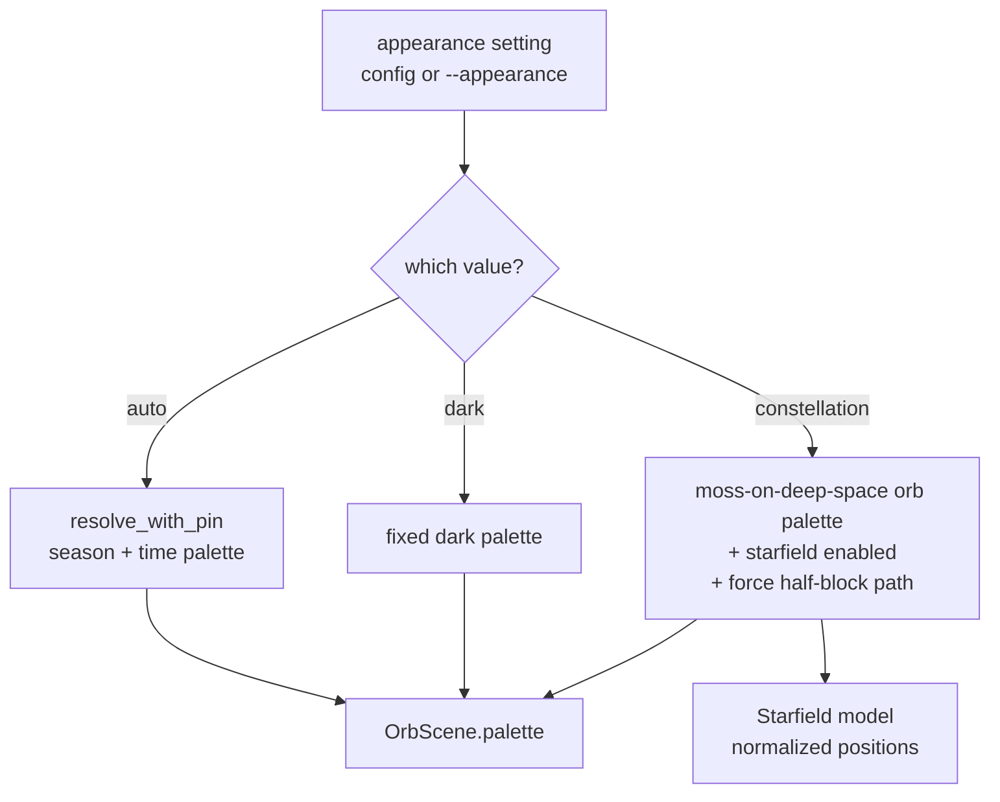
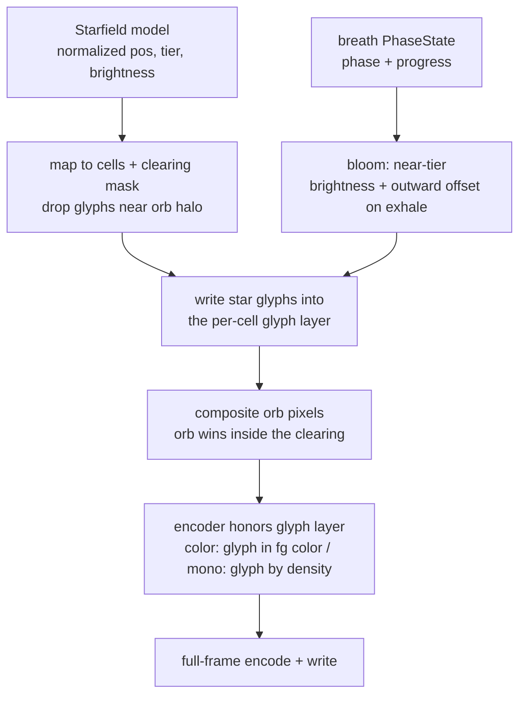

# feat: Constellation appearance — Stage 1 (depth + breath)

## Summary

Add a terminal-native `constellation` appearance to the breathing orb: a Unicode glyph starfield the orb floats in, with deep-space depth (brightness + density tiers), a clearing around the orb so the moss glow dominates, and the nearest stars blooming on the exhale. Ships as a third value on a single `auto | dark | constellation` appearance axis. Because the current renderer is pixel-only with a fixed per-cell character, the work begins by giving the renderer a per-cell glyph layer, then builds the field on top. This plan is Stage 1 — depth + breath, terminal only. Drift and seasonal color are later stages.

---

## Problem Frame

Today the orb's look is derived, not chosen: `crates/meditate-core/src/palette.rs` shifts a base moss tone by real season and time of day, and the background is a flat fill painted once behind the orb. The sibling iOS app reserves its most immersive look — Constellation — for an animated cosmos the meditation lives inside, and `web/src/orb-canvas.ts` already names it as a deliberately-absent, separate appearance mode (see origin: `docs/brainstorms/2026-06-06-constellation-appearance-requirements.md`).

One rendering reality shapes the whole plan: the CLI's `Surface` is a grid of RGB pixels (`Vec<Rgb>`), and each encoder emits one fixed character per cell — `▀` for the color tier, a luma block-ramp (` ░▒▓█`) for mono. There is no way to place a `✦` or `·` in a cell today. Delivering glyph stars therefore requires a per-cell glyph layer in the renderer before any field can be painted. This was confirmed against the codebase during plan review.

---

## Requirements

**Appearance model**

- R1. The orb's appearance is selectable on a single axis with three values: `auto`, `dark`, `constellation`.
- R2. `auto` preserves today's behavior — the orb palette derives from real season and time of day — and is the default when no appearance is set.
- R3. `dark` renders a fixed dark palette that does not shift with season or time.
- R4. `constellation` is self-contained, owning both its orb palette and its starfield. For Stage 1 the constellation orb palette is a fixed moss-on-deep-space; seasonal tinting is deferred to Stage 3.

**Render pipeline (prerequisite)**

- R17. The renderer gains a per-cell glyph channel: a cell may carry an optional glyph that overrides the default fill character, honored by both the color and mono encoders. A glyph cell still emits a background color (the deep-space fill) so the glyph renders on the correct backdrop. A cell with no glyph renders exactly as today.
- R18. In constellation mode the inline-graphics path (kitty/iTerm2) is bypassed in favor of the half-block path, because glyph cells cannot transit the image pipeline.

**The Constellation field (Stage 1: depth + breath)**

- R5. In constellation mode the orb floats in a field of Unicode glyph stars rendered into the cells surrounding the orb.
- R6. Stars are organized into depth tiers; depth reads through brightness and density — nearer stars brighter, distant stars dim.
- R7. A clearing surrounds the orb: stars fade to nothing as they approach the orb's halo so the moss glow stays dominant.
- R8. On each breath, the nearest stars bloom on the exhale — brighten and ease outward — and settle on the inhale, driven directly by the breath `PhaseState` (Inhale / HoldIn / Exhale / HoldOut + progress) that already feeds the orb.
- R9. Stage 1 delivers depth + breath with no required field motion; the mode must feel complete while static.
- R21. A star glyph never occupies a cell the orb's pixels cover at any breath phase. The clearing accounts for the orb's maximum dynamic reach (full-inhale scale and the outermost voice ring), and compositing erases any glyph in a cell the orb writes non-zero-alpha pixels into.

**Rendering, degradation & accessibility**

- R12. The field degrades across the render tiers: brightness-graded glyphs on the color tier; in mono / `NO_COLOR`, depth falls back to star density alone (glyph presence) with no brightness grading and no color codes emitted.
- R13. `reduce_motion` (config) and `REDUCE_MOTION` (env) soften the breath bloom while preserving the static depth and clearing.
- R14. The starfield must not regress orb legibility. The renderer re-encodes the entire frame each tick (there is no per-cell diff today), so the field must keep added per-frame escape volume bounded: only the near-tier bloom changes between frames; far stars stay static.
- R19. Star positions are resolution-independent; a resize reflows the field rather than reshuffling it, and a size change clears the previous frame region so no stale star cells remain.
- R20. On small terminals the clearing radius is clamped so a field remains outside the orb; below a minimum usable size the field is suppressed gracefully (renders as plain dark) rather than half-drawn.

**Configuration & control**

- R15. The selected appearance persists via the existing config mechanism and is overridable per-run by a CLI flag, mirroring `--pin-palette`.
- R16. Selecting an appearance does not break existing `--pin-palette` behavior. An invalid config value falls back to `auto` without erroring; an invalid CLI value errors clearly.

(R10 drift and R11 seasonal color are deferred to follow-up stages. See Scope Boundaries.)

---

## Key Technical Decisions

- KTD1. Appearance as a clap-free core enum resolved once at session start. Mirror the `Pin` enum and `--pin-palette` chain: a core `Appearance` enum, a clap `ValueEnum` in the CLI with a `From` into the core type, a config field, and a single resolution point where `palette::resolve_with_pin` is called in `src/session.rs`. One knob; constellation self-contained. (U1 plumbing was verified implementable as written.)
- KTD2. Add a per-cell glyph layer to the renderer — the foundational prerequisite. A cell gains an optional glyph that overrides its default fill; `cell_gradient.rs` and `mono.rs` honor it; a cell with no glyph renders unchanged. Without this the glyph-star vision is impossible, since `Surface` is pixel-only with a fixed per-cell character.
- KTD3. The starfield is a pure, deterministic, resolution-independent model. Star positions live in a normalized space mapped to current cells, with a fixed per-session seed, so a resize reflows rather than reshuffles. The model emits brightness 0..1; mapping to graded color or to glyph-presence happens at the render layer.
- KTD4. Depth is brightness + density tiers. The model emits per-star brightness; the render layer maps it to graded color on the color tier and to presence (density-only) on mono — satisfying R12's two depth modes from one model.
- KTD5. The breath bloom reads `PhaseState` directly (phase + progress), already passed into the draw path. Exhale blooms outward; inhale settles; the HoldIn/HoldOut phases map explicitly to peak/settled. No derivation from the orb-scale trajectory — scale is flat during holds, which makes a trajectory signal ambiguous on the box and relaxing patterns.
- KTD6. The clearing masks star glyphs within a radius of the orb halo, and the orb composites last. Because a cell holds either a star glyph or the orb's two pixels — the encoder emits the glyph whenever it is set, so paint order alone cannot make the orb "win" — compositing the orb clears the glyph layer for every cell it writes non-zero-alpha pixels into (glyph-erase on collision). The clearing radius also encompasses the orb's maximum dynamic reach (full-inhale scale plus the outermost voice ring, ~1.48× base radius) so far stars are never masked-in during a breath peak or while a guide speaks. Together these keep the moss glow from being pierced (R7, R21).
- KTD7. Constellation forces the half-block render path; the inline-graphics (kitty/iTerm2) path is disabled for the mode, because glyph cells cannot be carried through the pixelated image transmit.
- KTD8. The shared-core change is WASM-safe. `OrbScene` and `orb::paint` live in `meditate-core`, which compiles to WASM for the web app, and `crates/meditate-wasm/src/lib.rs` constructs `OrbScene` with a full struct literal. New fields are optional (default to "no field"), and the WASM construction site is updated in lockstep, so the web build keeps compiling and renders no field.

(The earlier plan claimed an "existing surface diff/encoder" that bounds churn — no such diff exists; `session.rs` re-encodes the whole frame each tick. That premise is removed; see Risks.)

---

## High-Level Technical Design

Appearance resolution at session start:

Frame compositing in constellation mode (with the new glyph layer):

---

## Implementation Units

### U1. Appearance setting and plumbing

- **Goal:** introduce the `auto | dark | constellation` axis end to end. `auto` and `dark` fully work; `constellation` is selectable and resolves its fixed orb palette (the field arrives in later units).
- **Requirements:** R1, R2, R3, R4 (orb-palette half), R15, R16.
- **Dependencies:** none.
- **Files:**
  - `crates/meditate-core/src/palette.rs` — add an `Appearance` enum (clap-free, like `Pin`); add a fixed `dark` palette and a fixed moss-on-deep-space constellation orb palette; add a resolver mapping appearance → `Palette` plus a "constellation active" signal.
  - `src/cli.rs` — add `--appearance <auto|dark|constellation>` as a clap `ValueEnum` mirroring `--pin-palette`, with a `From` into the core `Appearance`.
  - `src/config.rs` — add an `appearance: Option<String>` field and document it in the config default template.
  - `src/session.rs` — at the existing palette-resolution call, branch on appearance: `auto` → current `resolve_with_pin`; `dark` → fixed; `constellation` → constellation orb palette + the constellation flag carried into the render path.
  - Tests: `#[cfg(test)]` in `crates/meditate-core/src/palette.rs`.
- **Approach:** appearance resolves once at session start, like the palette. `--pin-palette` keeps working for `auto`/`dark`; in constellation mode a pin is silently ignored, since Stage 1 has no season tint to pin. An invalid config string falls back to `auto` (mirroring how `palette: Option<String>` is read today); an invalid CLI value errors via clap.
- **Patterns to follow:** the `Pin` enum, `resolve_with_pin`, and the `--pin-palette` `ValueEnum` + `From` chain.
- **Test scenarios:**
  - Covers AE4. Appearance unset → resolves to `auto` → `Palette` identical to today's `resolve_with_pin(None)` for a given season/time.
  - Appearance `dark` → returns the fixed dark `Palette` regardless of month/hour.
  - Covers AE5. Appearance `dark` combined with a `--pin-palette` value → behavior is defined and does not error (R16).
  - Appearance `constellation` → returns the moss-on-deep-space orb palette and reports constellation active.
  - `--appearance constellation` parses and overrides the config value; an invalid CLI value errors with a clear message.
  - A config file with `appearance = "invalid"` falls back to `auto` without erroring (mirrors the existing `palette` string handling).
- **Verification:** each appearance value resolves the expected orb palette; the `auto` path is unchanged from current behavior; `constellation` is selectable though no field draws yet.

### U2. Per-cell glyph layer in the renderer

- **Goal:** give the renderer a per-cell glyph channel so a cell can carry an optional glyph that overrides its default fill, and extend `OrbScene` with the inputs the field needs — without breaking the WASM build.
- **Requirements:** R17, R12 (mechanism), R18 (OrbScene carries the tier/flag), R14 (mechanism).
- **Dependencies:** U1.
- **Files:**
  - `crates/meditate-core/src/render/mod.rs` — add an optional per-cell glyph channel to the `Surface` (a parallel cell→glyph map or a glyph field per cell); expose a setter.
  - `crates/meditate-core/src/render/cell_gradient.rs` — when a cell has a glyph, emit that glyph in the cell's foreground color over its background color (the deep-space fill / bottom-pixel color), instead of `▀`.
  - `crates/meditate-core/src/render/mono.rs` — when a cell has a glyph, emit that glyph instead of the luma block; no color codes.
  - `crates/meditate-core/src/render/orb.rs` — extend `OrbScene` with optional fields: the starfield, the breath `PhaseState`, and the active render tier. All default to "no field".
  - `crates/meditate-wasm/src/lib.rs` — update the `OrbScene` struct-literal construction site so the web build compiles and constructs with no field.
  - Tests: `#[cfg(test)]` in `render/mod.rs` / the encoder modules.
- **Approach:** the glyph channel is additive and opt-in — when unset, both encoders behave exactly as today. `OrbScene` gains optional fields so the WASM caller (and any other) compiles unchanged and renders no field. The active tier is threaded onto `OrbScene` here so `orb::paint` can branch on it later (it currently receives only `Surface` + `OrbScene`).
- **Patterns to follow:** the existing `Surface` cell model and the two encoders in `cell_gradient.rs` / `mono.rs`.
- **Test scenarios:**
  - Covers AE6. A `Surface` with no glyphs set encodes byte-identically to today on both the color and mono encoders (regression guard for `auto`/`dark`).
  - A cell with a glyph set encodes that glyph in its foreground color on the color tier.
  - A glyph cell emits a background color (the deep-space fill), not a bare foreground + glyph, so no seam appears against deep space.
  - A cell with a glyph set on the mono tier encodes that glyph with no color escape codes.
  - The WASM crate compiles with the extended `OrbScene` and constructs it with no field.
- **Verification:** existing orb rendering is unchanged when no glyph is set; a glyph placed in a cell appears in both color and mono output; `cargo build` for the WASM target succeeds.

### U3. Starfield core model (pure, deterministic, resolution-independent)

- **Goal:** a pure, seeded model that produces the field — normalized star positions, depth tiers, per-star base brightness, the clearing mask, and the breath-bloom math — with no terminal I/O.
- **Requirements:** R5, R6, R7, R8 (math), R9, R19 (position model).
- **Dependencies:** U1.
- **Files:**
  - `crates/meditate-core/src/render/starfield.rs` (new) — a `Starfield` built from a fixed seed; star positions in normalized 0..1 space; depth tiers (e.g. far/near) each with a glyph set, a brightness band, and a density; a `cells(width, height, orb_center, clearing_radius)` projection that maps normalized positions to cells and drops those inside the clearing; a `bloom(phase, progress)` function mapping the breath `PhaseState` to near-tier brightness gain + radial offset.
  - `crates/meditate-core/src/render/mod.rs` — register the module and expose its types.
  - Tests: `#[cfg(test)]` in `starfield.rs`.
- **Approach:** deterministic given the seed, so the field is stable frame-to-frame (motion is Stage 2). Positions are resolution-independent so projecting to a new size reflows rather than reshuffles (R19). The model emits brightness 0..1; mapping to color or presence is the render layer's job. `bloom` reads the phase enum directly: Exhale (and HoldOut) ease near stars out and bright; Inhale (and HoldIn) settle them.
- **Patterns to follow:** the dependency-free, unit-tested style of `palette.rs`; `Rgb`/`lerp` in `render/mod.rs`.
- **Test scenarios:**
  - Generation is deterministic: the same seed produces an identical normalized star set.
  - Covers AE3. After projection, no star occupies the clearing radius around the orb center.
  - Covers AE7. Projecting the same field to a +/-1 row size preserves the bulk of star positions (reflow, not reshuffle).
  - Depth tiers partition stars; the near tier's brightness band exceeds the far tier's (R6).
  - Degenerate sizes (width/height 0 or 1) produce no panic and no `NaN`.
  - `bloom`: at Exhale peak, near-tier brightness exceeds baseline and the radial offset is positive; at Inhale it returns to baseline; HoldIn/HoldOut map to settled/peak without ambiguity (R8).
  - `bloom` output is bounded (brightness ≤ 1, offset ≤ a cap).
- **Verification:** model unit tests pass; the field is reproducible and reflows on resize; clearing and tier invariants hold across a range of sizes.

### U4. Render the constellation field with breath bloom

- **Goal:** project the field into the frame's glyph layer behind the orb on the color tier, drive the bloom from the live `PhaseState`, composite the orb on top with the clearing intact, and force the half-block path.
- **Requirements:** R5, R6, R7, R8, R9, R18, R21.
- **Dependencies:** U2, U3.
- **Files:**
  - `crates/meditate-core/src/render/orb.rs` — in the paint path, when constellation is active: fill the deep-space background, project the starfield to cells, write star glyphs into the glyph layer (brightness → foreground color per tier) honoring the clearing, then composite the orb so it wins inside the clearing.
  - `src/session.rs` — build and hold the `Starfield` (fixed session seed), pass it plus the current `PhaseState` and active tier into the scene at the frame-render path, and force the half-block renderer (skip inline graphics) when appearance is constellation.
  - Tests: inline tests for the pure color-mapping and a render regression guard where feasible.
- **Approach:** stars are written as glyph cells colored by tier brightness; the orb composites last, and compositing erases any star glyph in cells the orb writes non-zero-alpha pixels into (glyph-erase on collision), with the clearing sized to the orb's maximum dynamic reach (full-inhale scale plus the outermost voice ring) so the halo/core always win (KTD6, R21). The bloom maps the current phase through U3's `bloom`. The field is static except the bloom, so far-star cells are unchanged between frames (R14).
- **Patterns to follow:** the existing `orb.rs` paint order (background → orb → ripples) and the `src/session.rs` frame-render path; the existing `use_graphics` gate to force half-block.
- **Test scenarios:**
  - Covers AE1. At an Exhale phase, near-tier glyph cells are brighter / offset versus an Inhale phase.
  - Covers AE3. In the composited frame, the orb halo region contains no star glyphs.
  - Covers AE9. With appearance constellation on a graphics-capable terminal, the half-block path is selected (inline graphics skipped) and star glyphs are present.
  - Covers AE10. A cell receiving both a star glyph and orb body/halo/voice-ring pixels encodes the orb, not the glyph (glyph-erase on collision), at full-inhale scale and during voice playback.
  - Brightness → color mapping: a tier brightness maps to the expected foreground color on the color tier (pure-function test).
  - Constellation off (`auto`/`dark`): the frame render is unchanged from current — regression guard.
- **Verification:** `--appearance constellation` on a color terminal shows the orb in a glyph starfield with a clear halo and stars blooming on the exhale; on a kitty/iTerm2 terminal the field still appears (half-block path); `auto`/`dark` look unchanged.

### U5. Tier degradation and reduce-motion

- **Goal:** make the field correct under render-capability and accessibility constraints — density-only depth on mono / `NO_COLOR`, and a softened bloom under reduce-motion.
- **Requirements:** R12, R13.
- **Dependencies:** U2, U4.
- **Files:**
  - `crates/meditate-core/src/render/orb.rs` — branch the star mapping on the active tier carried by `OrbScene`: color tier → brightness-graded foreground color; mono / none / `NO_COLOR` → glyph presence by density only, no color codes.
  - `src/session.rs` — thread `reduce_motion` (config) and `REDUCE_MOTION` (env), already read by the existing animation path, into the bloom amplitude.
  - Tests: inline tests for the tier mapping and reduce-motion scaling.
- **Approach:** the render layer chooses graded-color vs presence by the tier on `OrbScene` (threaded in U2). `reduce_motion` scales the bloom amplitude toward zero while the static depth and clearing remain.
- **Patterns to follow:** the existing render-tier detection; the existing `reduce_motion` threading in the animation path.
- **Test scenarios:**
  - Covers AE2. A mono / `NO_COLOR` tier renders the field as glyphs with depth via density only, emitting no color escape codes.
  - A color tier renders brightness-graded star colors.
  - `reduce_motion` on → bloom amplitude reduced toward zero; static depth + clearing still render (R13).
  - `reduce_motion` off → full bloom amplitude.
- **Verification:** `NO_COLOR=1` shows a coherent density-depth glyph field; `REDUCE_MOTION=1` stills the bloom; the color tier is unaffected.

### U6. Resize and terminal-size robustness

- **Goal:** keep the field coherent as the terminal changes size — reflow on resize, clear stale cells on shrink, and degrade gracefully on small terminals.
- **Requirements:** R19, R20, R14 (escape-volume awareness).
- **Dependencies:** U3, U4.
- **Files:**
  - `src/session.rs` — on a detected size change, clear the orb region before writing the resized frame so a shrink leaves no stale star cells; re-project (not regenerate) the field to the new size.
  - `crates/meditate-core/src/render/starfield.rs` — clamp the clearing radius so a field remains outside the orb on small sizes; below a minimum usable size, project to an empty field (constellation renders as plain dark).
  - Tests: inline tests for clamp/suppress behavior; a session-level resize behavior note.
- **Approach:** because positions are normalized (U3), a resize re-projects to new cells — the layout reflows. The draw path clears the region on size change to avoid stale glyph cells (today it only homes the cursor). On small terminals the clearing can swallow the field; clamp it, and suppress the field below a minimum size rather than half-drawing it.
- **Patterns to follow:** the existing `terminal::size()` read in the draw path.
- **Test scenarios:**
  - Covers AE7. A shrink resize leaves no star cells beyond the new frame bounds; a +/-1 row resize reflows rather than reshuffles.
  - Covers AE8. On a small terminal (e.g. 40x12) either a non-empty field renders outside the clearing, or the field is suppressed to plain dark — never a half-drawn field.
  - The clearing radius never exceeds the available field area on small sizes.
- **Verification:** resizing mid-session reflows the field smoothly with no stranded glyphs; small panes either show a sensible field or fall back to plain dark.

---

## Acceptance Examples

- AE1. Breath bloom
  - **Covers R8, R13.** Units U4, U5.
  - **Given** constellation mode with `reduce_motion` off, **when** the user exhales, **then** the nearest stars brighten and ease outward; on the inhale they settle. With `reduce_motion` on, the bloom is present but subdued.
- AE2. Mono / NO_COLOR degradation
  - **Covers R12.** Units U2, U5.
  - **Given** a mono or `NO_COLOR` terminal, **when** constellation renders, **then** stars appear as glyphs with depth conveyed by density only — no brightness grading and no color codes emitted.
- AE3. The clearing
  - **Covers R7.** Units U3, U4.
  - **Given** any render tier, **when** the field paints, **then** no star glyph occupies the clearing around the orb's halo and the moss glow is unobstructed.
- AE4. Default is unchanged
  - **Covers R1, R2.** Unit U1.
  - **Given** no appearance configured, **when** a session starts, **then** `auto` behavior renders (today's season/time palette), identical to current.
- AE5. Fixed dark
  - **Covers R3, R16.** Unit U1.
  - **Given** `appearance = dark`, **when** a session starts, **then** a fixed dark palette renders with no season/time shift, and `--pin-palette` still behaves without error.
- AE6. Glyph layer is a no-op when unused
  - **Covers R17.** Unit U2.
  - **Given** `auto` or `dark` (no field), **when** a frame encodes, **then** output is byte-identical to today on both the color and mono encoders.
- AE7. Resize reflow
  - **Covers R19.** Units U3, U6.
  - **Given** constellation mode, **when** the terminal resizes by a row or shrinks, **then** the field reflows (bulk of positions preserved) and no stale star cells remain outside the new bounds.
- AE8. Small terminal
  - **Covers R20.** Unit U6.
  - **Given** a small terminal (e.g. 40x12), **when** constellation renders, **then** either a non-empty field appears outside the clearing or the field is suppressed to plain dark — never half-drawn.
- AE9. Graphics-capable terminal
  - **Covers R18.** Unit U4.
  - **Given** a kitty/iTerm2 terminal with `appearance = constellation`, **when** a session renders, **then** the half-block path is used (inline graphics skipped) and the star field is present, not silently dropped.
- AE10. Orb wins over star glyphs
  - **Covers R21.** Units U2, U4.
  - **Given** constellation mode at full inhale or while a guide speaks (orb and voice rings expanded), **when** the frame composites, **then** no star glyph appears in a cell the orb's pixels cover — the orb renders, not the glyph.

---

## Scope Boundaries

**Deferred to follow-up work** (later stages of this feature)

- Stage 2 — gentle drift: continuous field motion plus twinkle/jitter.
- Stage 3 — seasonal/time color: tinting the field and the constellation orb palette by real season and time of day.
- Encoder-level frame diffing to reduce per-frame escape volume — pursue only if measurement shows the field strains slow/SSH terminals.

**Deferred for later** (from origin)

- Web/canvas constellation on the smooth orb.
- Kitty/iTerm graphics-tier real starfield imagery (Stage 1 forces the half-block path instead).
- Soundscape-linked shimmer.

**Outside this product's identity** (from origin)

- Light and system appearance modes on the terminal — a light/parchment background fights the terminal and washes out the moss; "follow the OS appearance" isn't a terminal concept. May return only when the web surface arrives.
- Milestone/streak "light up a star" gamification — clashes with the calm, non-achievement ethos.

---

## Open Questions

**Deferred to implementation**

- Where the glyph channel lives — a field on the existing `Surface` cell vs a parallel cell→glyph map. An implementation detail to settle in U2 against `render/mod.rs`.
- Tuning: depth-tier count, brightness curve, glyph sets, density, clearing radius and its small-size clamp, bloom amplitude/easing — set visually.
- Per-frame escape-volume budget — measure the field's byte delta versus the flat fill on a slow/SSH terminal; this informs whether the deferred encoder-diffing work becomes necessary.

---

## Risks & Dependencies

- Dependency: the breath `PhaseState` (phase + progress) is already exposed and passed into the draw path (verified) — the bloom reads it directly; no new clock and no trajectory derivation.
- Risk: the renderer re-encodes the full frame each tick (no per-cell diff). A dense or animated field raises per-frame escape volume on slow/SSH terminals. Mitigation: keep the field mostly static (only the near-tier bloom changes); measure the delta; encoder-level diffing is deferred follow-up if needed (R14).
- Risk: the shared-core `OrbScene`/`orb::paint` change must not break the WASM/web build. Mitigation: optional fields defaulting to "no field" and updating the WASM construction site in lockstep (KTD8, U2).
- Risk: because a cell holds either a star glyph or the orb's pixels, a star could clobber the orb's dynamic edge (full-inhale scale, voice rings to ~1.48× base) and pierce the moss glow. Mitigation: glyph-erase on collision plus a clearing sized to the orb's maximum dynamic reach (KTD6, R21).
- Risk: small terminals leave no room outside the clearing, making constellation look identical to plain dark. Mitigation: clamp the clearing and suppress the field below a minimum size (R20, U6).

---

## System-Wide Impact

- Touches the shared render core: the `Surface` cell model and both encoders (`cell_gradient.rs`, `mono.rs`) gain a glyph channel, and `OrbScene`/`orb::paint` gain optional fields. This core is consumed by both the CLI and the WASM/web build, so the web build must keep compiling; it renders no field (additive, backward-compatible).
- New CLI flag `--appearance` and config field `appearance` — an additive external contract surface (CLI users and the config schema). No existing field changes meaning.
- Constellation forces the half-block path on graphics-capable terminals (the inline-graphics orb is bypassed only in that mode).
- No data, auth, or performance-critical systems are touched beyond the render loop.

---

## Sources & Research

These were verified against the codebase during plan review:

- `crates/meditate-core/src/palette.rs` — `Palette`, `Pin`, `resolve_with_pin` to mirror for appearance.
- `crates/meditate-core/src/render/mod.rs` — the `Surface` pixel model (no glyph channel today) and the render-tier detection.
- `crates/meditate-core/src/render/cell_gradient.rs`, `crates/meditate-core/src/render/mono.rs` — the two encoders (fixed `▀` / luma ramp) that must gain glyph support.
- `crates/meditate-core/src/render/orb.rs` — `OrbScene` and the paint compositing order; `surface.blend` alpha layering near the halo.
- `crates/meditate-core/src/breath.rs` — `PhaseState` / `Phase` (Inhale/HoldIn/Exhale/HoldOut/Still) the bloom reads directly.
- `src/session.rs` — the palette-resolution call, the frame-render path (full re-encode each tick, cursor home — no diff), the `use_graphics` gate, and `terminal::size()`.
- `crates/meditate-wasm/src/lib.rs` — the `OrbScene` struct-literal construction site that must be updated when fields are added.
- `src/cli.rs`, `src/config.rs` — the flag and persistence patterns to follow.
- `web/src/orb-canvas.ts` (the comment block near the top) — defines Constellation as a distinct appearance mode; the deferred web target.
